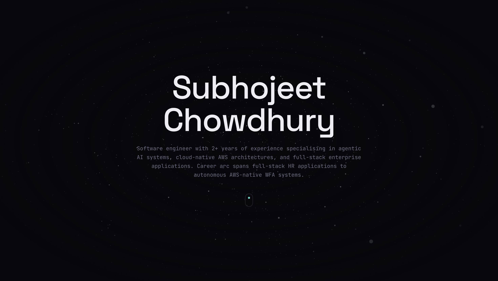

# Subhojeet Chowdhury — Software Engineer



Interactive developer portfolio showcasing my career journey and selected works in Agentic AI, Cloud Architecture, and Full-Stack Engineering. 

Designed for performance and aesthetics, featuring custom WebGL components, scroll-linked magnetic animations, and a dynamic Bento Grid.

## 🚀 Tech Stack

- **Framework:** Next.js 15 (React 19)
- **Styling:** Tailwind CSS v4
- **Animations:** Framer Motion (useScroll, useTransform, useSpring)
- **3D Graphics:** React Three Fiber & Drei (WebGL Instanced Rendering)
- **Typography:** Space Grotesk, Inter, JetBrains Mono

## 🧠 Architecture Highlights

- **Data-Driven UI:** All content (skills, experience, projects) is decoupled from the UI and centralized in a single `portfolio.json` for easy maintenance and future backend integration.
- **Scroll-Linked Animations:** High-performance viewport tracking using Framer Motion to drive 3D tilting timeline cards and sticky stacked parallax project decks without blocking the main thread.
- **WebGL Fallbacks:** Lightweight, primitive GLSL shaders and instanced meshes ensure 60fps performance even on mobile devices.

## 🛠️ Local Development

Clone the repository and install dependencies:

```bash
npm install
npm run dev
```

Open [http://localhost:3000](http://localhost:3000) to view it in your browser.

## 📄 License

MIT
